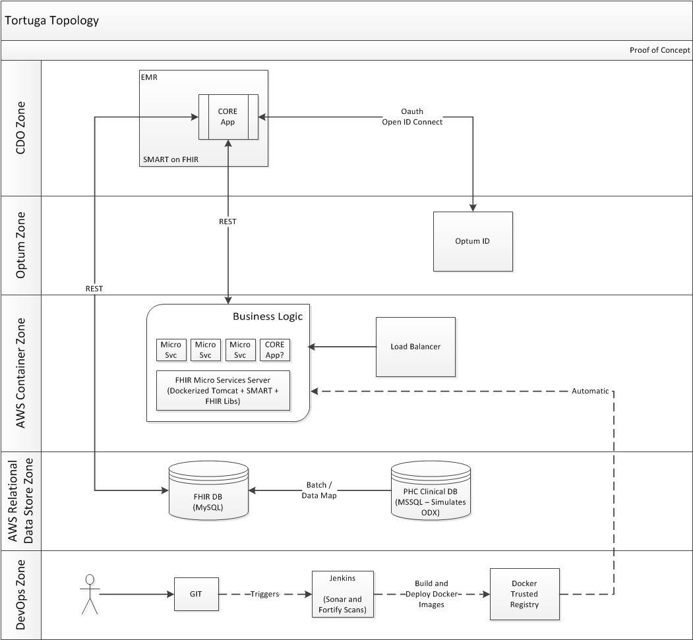

# How To Add New Graphic Pages
1) Upload new graphic (.jpg or .png should work) to /src/images
2) Create new html page in the simpleWeb/src directory with name relating to image focus (ex. securityDiagram.html)
3) Copy the following code, replacing the image name in the src url with the image you uploaded

```
<html lang="en">
<head>
</head>
<body>
                                                              <!-- Change Src -->
  
</body>
</html>
```
4)  (optional) Test by accessing url at https://codyscoggins.github.io/SimpleDocs/"yourPage".html
(For example, the topology image page I uploaded following these steps can be accessed at https://codyscoggins.github.io/SimpleDocs/topology.html")
5) Add the newly created URL to the Desktop file named "docs-list.ts" with the appropriate fields (name, creator, link)
